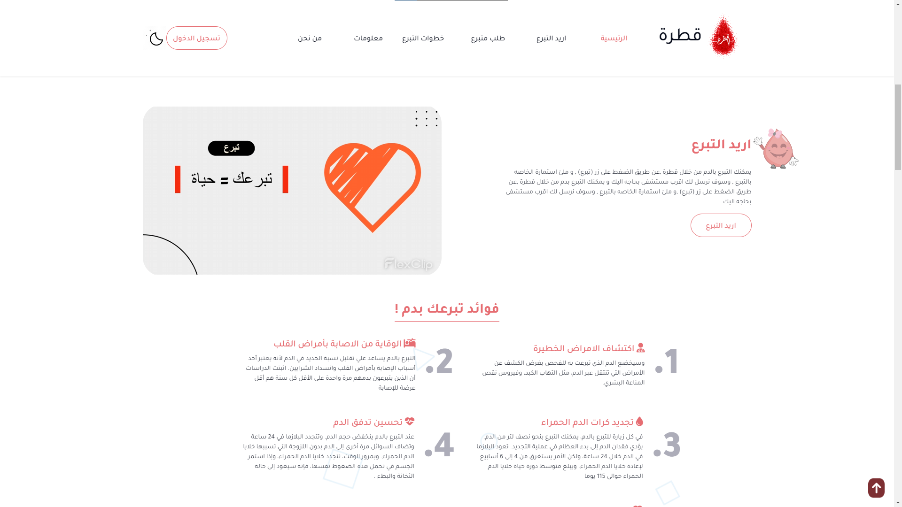

# QATRA 🩸

Qatra Blood Bank Management website is a web application designed to help manage and track blood donations and inventory for a blood bank. The website is primarily for blood bank staff, healthcare providers, and donors who want to register, schedule appointments, and keep track of their donation history.

The website offers features such as blood donation registration, inventory management, search functionality, notifications, and reporting. Blood bank staff can manage their inventory, including tracking available blood types, expiration dates, and quantities. Healthcare providers can search for blood banks, blood types, and donation centers in their area.

Users can receive notifications about upcoming blood drives, donation opportunities, and inventory updates. The website generates reports on blood bank inventory levels, donation history, and other important metrics.

Overall, Qatra Blood Bank Management website provides an easy-to-use platform for donors, blood bank staff, and healthcare providers to manage and track blood donations and inventory. It helps improve the efficiency of blood bank operations, ensuring the availability of blood when needed, and ultimately saves lives.

YOU CAN SEE OUR WEBSITE --> https://qatra.cardigoo.com
## Installation

Install python 3.10.8 version first THEN Install requirements file
```bash
  pip install -r requirements.txt
```
    
## Environment Variables

To run this project, you will need to add the following environment variables to your .env file

`SECRET_KEY`

`DB_HOST` `DB_PORT` `DB_NAME` `DB_USER` `DB_PASSWORD`

`EMAIL_HOST` `EMAIL_PORT` `EMAIL_USE_TLS` `EMAIL_HOST_USER` `EMAIL_HOST_PASSWORD`

`SOCIAL_AUTH_GOOGLE_OAUTH2_KEY`

`SOCIAL_AUTH_GOOGLE_OAUTH2_SECRET`
## Deployment

To deploy this project run

```bash
  python manage.py runserver
```


## Demo

Our [Demo](https://drive.google.com/open?id=1BOn5Aa7XsZoh1dGMjPg7FnwjIZmeH6pJ&authuser=nayfserag5%40gmail.com&usp=drive_fs) Video


##Presentation

Our [Presentation](https://www.canva.com/design/DAFfK3zh0Hc/6HOkhFJgVXwXCPMXk5UZlA/view?  utm_content=DAFfK3zh0Hc&utm_campaign=designshare&utm_medium=link&utm_source=publishsharelink) On canva

## Screenshots


<p align="center"> </p>


<p align="center"></p>


<p align="center"></p>


<p align="center"></p>


<p align="center"></p>


<p align="center"></p>


<p align="center"></p>


<p align="center"></p>


<p align="center"></p>


<p align="center"></p>

## Logo
<p align="center">
  

</p>

## Color Reference

| Color             | Hex                                                                |
| ----------------- | ------------------------------------------------------------------ |
|  Color 1|  #f23c4a |
|  Color 2|  #090E1C |
|  Color 3|  #FDFDFD |
|  Color 4|  #E98B82 |


## Appendix

This is Our [Notion](https://flash-punishment-560.notion.site/Graduation-Project-eb4e5f1542d94adb9f19b6736531280f) for Qatra 


## Documentation

[Documentation](https://drive.google.com/open?id=1BTHrqDshYoPWMpHK_Nm2ykbo_4JmE0Z6&authuser=nayfserag5%40gmail.com&usp=drive_fs)


## Team members

- [@nayefserag](https://github.com/nayefserag) as a Back-End

## 🚀 About Me
Hi there! My name is Nayef and I am a full-stack developer. I have a passion for creating web applications that are both functional and aesthetically pleasing.

I recently completed my graduation project, which was a Blood Bank management system. Throughout this project, I was able to apply my skills in both front-end and back-end development, creating a fully-functional web application from start to finish.

As a full-stack developer, I have experience working with a variety of programming languages and technologies. I am also committed to staying up-to-date with the latest industry trends and best practices in order to provide the best possible solutions for my clients.

If you're interested in working with me or would like to learn more about my experience and skills, please don't hesitate to reach out. I'm always open to new opportunities and collaborations!


# Hi, I'm Nayef! 👋


## 🔗 Links
[](https://github.com/nayefserag)

[](https://www.linkedin.com/in/nayf-serag-70a3611b8)

[](https://www.facebook.com/nayf.serag.9?mibextid=ZbWKwL)


## Feedback

If you have any feedback, please reach out to us at Qatra2023@gmail.com

